# Kishore R — Portfolio

**Personal portfolio and AI-powered CMS for Kishore R**, an Aspiring AI/ML & Generative AI Engineer. The site showcases projects, blog articles, skills, certifications, and coding activity — and features a real-time **Gemini Live voice & text AI assistant** that visitors can talk to directly on the page.

```text
┌────────────────────────────────────────────────────────┐
│                  kishoreabc.dev                        │
├────────────────────────────────────────────────────────┤
│  Public Portfolio (SSR/ISR) ─── Next.js 16 + React 19 │
│         ↓ Gemini Live AI Assistant (voice + chat)      │
│  Admin CMS (auth-gated) ─── CRUD for all content       │
│                ↓                                       │
│   Next.js API Routes ─── Server Actions                │
│                ↓                                       │
│   Prisma ORM ──→ Neon PostgreSQL (serverless)          │
│                ↓                                       │
│   External: GitHub API · Resend · Cloudinary · Tavily  │
└────────────────────────────────────────────────────────┘
```

---

## Table of Contents

- [Project Overview](#1-project-overview)
- [Technology Stack](#2-technology-stack)
- [High-Level Architecture](#3-high-level-architecture)
- [Repository / Folder Architecture](#4-repository--folder-architecture)
- [Complete Page / Route Map](#5-complete-page--route-map)
- [Page → Component Mapping](#6-page--component-mapping)
- [Component Architecture](#7-component-architecture)
- [Component Dependency Map](#8-component-dependency-map)
- [Page-to-Component Matrix](#9-page-to-component-matrix)
- [Data Flow Architecture](#10-data-flow-architecture)
- [API Architecture](#11-api-architecture)
- [State Management Architecture](#12-state-management-architecture)
- [Authentication & Authorization Flow](#13-authentication--authorization-flow)
- [AI Agent Architecture](#14-ai-agent-architecture)
- [User Journey / Main Flows](#15-user-journey--main-flows)
- [Detailed Page Architecture](#16-detailed-page-architecture)
- [Cross-Page Navigation](#17-cross-page-navigation)
- [External Integrations](#18-external-integrations)
- [Configuration & Environment](#19-configuration--environment)
- [Build & Deployment Architecture](#20-build--deployment-architecture)
- [Important Architectural Decisions](#21-important-architectural-decisions)
- [Architecture Summary](#22-architecture-summary)

---

## 1. Project Overview

**Kishore R Portfolio** is a full-stack Next.js 16 web application serving two audiences:

| Audience | Purpose |
|---|---|
| **Visitors / Recruiters** | Browse projects, blogs, skills, certifications, coding stats; chat or speak with the on-page AI assistant |
| **Portfolio Owner (Admin)** | Manage all content through an auth-gated CMS dashboard |

**Major functionality:**
- Single-page portfolio with animated sections (Hero, About, Skills, Projects, Certifications, Blogs, Coding, Journey, Contact)
- Standalone detail pages for every blog post and project (SEO-optimised with ISR)
- **Gemini Live AI Assistant** — voice mode (real-time bidirectional WebSocket audio) and text-chat mode — scoped strictly to the owner's professional information via dynamic tool-calling
- Admin CMS with full CRUD for every content type, contact-message inbox with AI-assisted reply drafts, and AI conversation logs
- Visitor counter, GitHub contribution heatmap, LeetCode activity heatmap
- Contact form with Resend email delivery

---

## 2. Technology Stack

| Layer | Technology | Purpose |
|---|---|---|
| **Framework** | Next.js 16 (App Router) | SSR, ISR, API routes, Server Actions |
| **Frontend** | React 19 | UI components, client interactivity |
| **Styling** | Tailwind CSS v4 + `tw-animate-css` | Utility-first styling, animations |
| **UI Library** | shadcn/ui + Radix UI primitives | Design-system components (dialog, badge, table, etc.) |
| **Animation** | Motion (`motion/react`) | Section entrance and micro animations |
| **Icons** | Lucide React | Consistent icon set |
| **Database** | Neon PostgreSQL (serverless) | Persistent data store |
| **ORM** | Prisma v5 + `@prisma/adapter-neon` | Type-safe DB access, migrations |
| **Authentication** | Auth.js v5 + GitHub OAuth | Admin-only single-provider auth (JWT strategy) |
| **AI** | Google Gemini (`@google/genai`) | Live voice/text agent, ephemeral token auth |
| **Email** | Resend | Contact form delivery, admin reply |
| **Image CDN** | Cloudinary | Project/blog/profile image hosting |
| **Web Search** | Tavily + Google Search Grounding | AI agent real-time search tools |
| **Forms** | React Hook Form + Zod | Validated forms (contact & admin) |
| **Notifications** | Sonner (toast) | In-app feedback toasts |
| **Markdown** | react-markdown | Blog post content rendering |
| **Build** | TypeScript 5 + ESLint 9 + PostCSS | Type safety, linting, CSS pipeline |

---

## 3. High-Level Architecture

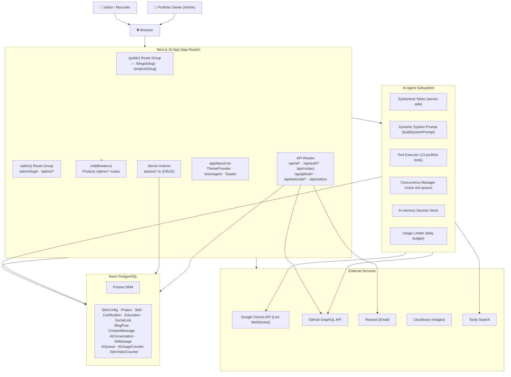

---

## 4. Repository / Folder Architecture

```text
Portfolio/
│
├── app/                          # Next.js App Router
│   ├── (public)/                 # Public route group (no auth)
│   │   ├── page.tsx              # Homepage — main portfolio SPA
│   │   ├── blogs/[slug]/         # Blog post detail page
│   │   └── projects/[slug]/      # Project detail page
│   │
│   ├── (admin)/                  # Admin route group (auth-protected)
│   │   └── admin/
│   │       ├── login/            # GitHub OAuth login page
│   │       └── (dashboard)/      # Dashboard layout group
│   │           ├── layout.tsx    # AdminSidebar + auth check
│   │           ├── page.tsx      # Dashboard overview
│   │           ├── projects/     # Project CRUD
│   │           ├── blogs/        # Blog CRUD
│   │           ├── certifications/
│   │           ├── skills/
│   │           ├── education/
│   │           ├── journey/
│   │           ├── social-links/
│   │           ├── messages/     # Contact message inbox
│   │           ├── ai-conversations/  # AI conversation logs
│   │           │   └── [id]/    # Individual conversation transcript
│   │           └── profile/      # SiteConfig editor
│   │
│   ├── api/                      # Next.js API Routes
│   │   ├── ai/
│   │   │   ├── session/          # POST: create AI session + ephemeral token
│   │   │   │   ├── status/       # GET: session status
│   │   │   │   └── terminate/    # POST: end session
│   │   │   ├── conversation/message/  # POST: save AI transcript message
│   │   │   ├── queue/[queueId]/  # GET: voice queue position polling
│   │   │   └── tool/             # POST: AI tool executor
│   │   ├── auth/[...nextauth]/   # Auth.js handlers
│   │   ├── contact/              # POST: contact form submission
│   │   ├── github/sync/          # POST: sync GitHub repo stats (admin)
│   │   ├── leetcode/heatmap/     # GET: LeetCode activity heatmap
│   │   └── visitors/             # GET/POST: visitor counter
│   │
│   ├── layout.tsx                # Root layout: fonts, JSON-LD, ThemeProvider, VoiceAgent
│   ├── globals.css               # Global CSS, Tailwind base, design tokens
│   ├── robots.ts                 # Dynamic robots.txt
│   └── sitemap.ts                # Dynamic XML sitemap
│
├── components/
│   ├── public/                   # Public portfolio section components
│   │   ├── Navbar.tsx
│   │   ├── Hero.tsx
│   │   ├── About.tsx
│   │   ├── Skills.tsx
│   │   ├── Projects.tsx          # Project card grid + ProjectModal
│   │   ├── ProjectModal.tsx
│   │   ├── Certifications.tsx    # Certification grid + CertificateModal
│   │   ├── CertificateModal.tsx
│   │   ├── Blogs.tsx             # Blog card grid + BlogModal
│   │   ├── BlogModal.tsx
│   │   ├── CodingSection.tsx     # GitHub & LeetCode heatmaps, stats
│   │   ├── Journey.tsx           # Career/education timeline
│   │   ├── Contact.tsx           # Contact form (react-hook-form + zod)
│   │   ├── Footer.tsx
│   │   └── VisitorCounter.tsx    # Animated live visitor count
│   │
│   ├── ai/                       # AI assistant components
│   │   ├── VoiceAgent.tsx        # Floating FAB + mode picker launcher
│   │   ├── AgentPanel.tsx        # Full agent panel (voice + chat UI)
│   │   ├── AgentControls.tsx     # Voice session controls (mute, end, timer)
│   │   ├── AgentStatusBadge.tsx  # Connection/session status indicator
│   │   ├── AgentTranscript.tsx   # Chat transcript renderer (markdown)
│   │   ├── AudioManager.ts       # Web Audio API manager (mic, speakers)
│   │   ├── QueueWaiting.tsx      # Queue position UI (voice mode)
│   │   └── VoiceVisualizer.tsx   # Real-time audio waveform visualizer
│   │
│   ├── admin/                    # Admin CMS components
│   │   ├── AdminSidebar.tsx      # Navigation sidebar with unread badge
│   │   ├── ProfileForm.tsx       # SiteConfig full-page form
│   │   ├── ProjectDialog.tsx     # Create/edit project modal
│   │   ├── ProjectRowActions.tsx # Edit/delete/sync to GitHub
│   │   ├── BlogDialog.tsx        # Create/edit blog modal
│   │   ├── BlogRowActions.tsx
│   │   ├── CertificationDialog.tsx
│   │   ├── SkillDialog.tsx
│   │   ├── EducationDialog.tsx
│   │   ├── JourneyDialog.tsx
│   │   ├── SocialLinkDialog.tsx
│   │   ├── MessageRowActions.tsx # Mark read/replied, delete
│   │   ├── SuggestReplyDialog.tsx # AI-drafted email reply modal
│   │   ├── DeleteAiConversationButton.tsx
│   │   ├── RevokeSessionButton.tsx
│   │   └── CloudinaryUpload.tsx  # Image upload widget
│   │
│   ├── ui/                       # shadcn/ui primitives (20 components)
│   │   └── button · badge · card · dialog · table · input · textarea · select
│   │       tabs · tooltip · sheet · avatar · alert-dialog · dropdown-menu
│   │       scroll-area · skeleton · separator · switch · sonner · markdown-view
│   │
│   └── theme-provider.tsx        # next-themes wrapper
│
├── lib/
│   ├── auth.ts                   # Auth.js v5 config (GitHub OAuth, JWT)
│   ├── db.ts                     # Prisma client singleton
│   ├── email.ts                  # Resend integration (contact + reply)
│   ├── github.ts                 # GitHub GraphQL API (heatmap, repo data)
│   ├── leetcode.ts               # LeetCode heatmap fetcher
│   ├── rate-limit.ts             # In-memory IP rate limiter (contact form)
│   ├── require-admin.ts          # Server-side admin guard helper
│   ├── utils.ts                  # cn(), sortJourneyEntries, etc.
│   ├── validations.ts            # Zod schemas (contact, all CRUD forms)
│   └── ai/
│       ├── config.ts             # Central AI config (limits, URLs, model)
│       ├── concurrency.ts        # Voice slot manager + Prisma queue
│       ├── ephemeral-token.ts    # Gemini ephemeral token creation
│       ├── rate-limiter.ts       # Per-IP session rate limiter
│       ├── resources.ts          # Pre-fetched resource URLs for agent
│       ├── security.ts           # IP extraction, origin allowlist, SHA-256 hash
│       ├── session-store.ts      # In-memory active session registry
│       ├── system-prompt.ts      # Dynamic system prompt builder
│       ├── usage-limit.ts        # Daily budget checker (Prisma-backed)
│       └── tools/
│           ├── tool-declarations.ts  # 13 Gemini FunctionDeclaration objects
│           ├── tool-executor.ts      # Server-side tool dispatcher
│           ├── portfolio.ts          # Portfolio data tools
│           ├── github.ts             # GitHub data tools
│           └── search.ts             # Tavily + Google Grounding search tool
│
├── actions/                      # Next.js Server Actions (admin CRUD)
│   └── blog · certification · education · journey · message · profile
│       project · skill · social-link · ai-conversation
│
├── types/
│   ├── index.ts                  # JourneyEntry, Achievement, LeetCodeHeatmapData, FormState, ActionResult
│   └── ai.ts                     # AgentMode, AgentState, ALLOWED_TOOLS, session types
│
├── prisma/
│   ├── schema.prisma             # 13 Prisma models
│   ├── seed.ts                   # DB seed script
│   └── migrations/               # SQL migration history
│
├── public/                       # Static assets (icons, manifest, favicons)
├── middleware.ts                 # Auth middleware (protects /admin/*)
├── next.config.ts                # Next.js config (image domains)
├── package.json
└── tsconfig.json
```

### Directory Responsibilities

| Directory | Responsibility | Key Files |
|---|---|---|
| `app/(public)` | Public-facing portfolio pages (SSR+ISR) | `page.tsx`, `blogs/[slug]/page.tsx`, `projects/[slug]/page.tsx` |
| `app/(admin)/admin` | Auth-protected CMS dashboard | `login/page.tsx`, `(dashboard)/layout.tsx`, all section `page.tsx` |
| `app/api/ai` | AI session lifecycle + tool execution | `session/route.ts`, `tool/route.ts`, `queue/[queueId]/route.ts` |
| `app/api` | Contact form, visitor counter, GitHub sync, LeetCode | `contact/route.ts`, `visitors/route.ts`, `github/sync/route.ts` |
| `components/public` | All public portfolio UI sections | `Hero.tsx`, `CodingSection.tsx`, `Contact.tsx`, etc. |
| `components/ai` | AI assistant UI (launcher → panel → voice/chat) | `VoiceAgent.tsx`, `AgentPanel.tsx`, `VoiceVisualizer.tsx` |
| `components/admin` | Admin CRUD dialogs, row actions, sidebar | `AdminSidebar.tsx`, `*Dialog.tsx`, `*RowActions.tsx` |
| `components/ui` | shadcn/ui primitive components | all `*.tsx` |
| `lib/ai` | Server-side AI infrastructure | `config.ts`, `concurrency.ts`, `session-store.ts`, `tools/` |
| `lib` | Shared server utilities | `auth.ts`, `db.ts`, `email.ts`, `github.ts`, `validations.ts` |
| `actions` | Server Actions for all admin CRUD | one file per content type |
| `types` | Shared TypeScript interfaces | `index.ts`, `ai.ts` |
| `prisma` | DB schema, migrations, seed | `schema.prisma`, `seed.ts` |

---

## 5. Complete Page / Route Map

| Route | File | Layout | Auth | Purpose |
|---|---|---|---|---|
| `/` | `app/(public)/page.tsx` | Root layout | Public | Full single-page portfolio |
| `/blogs/[slug]` | `app/(public)/blogs/[slug]/page.tsx` | Root layout | Public | Blog post detail page |
| `/projects/[slug]` | `app/(public)/projects/[slug]/page.tsx` | Root layout | Public | Project detail page |
| `/admin/login` | `app/(admin)/admin/login/page.tsx` | Root layout | Public | GitHub OAuth login |
| `/admin` | `app/(admin)/admin/(dashboard)/page.tsx` | AdminLayout | Admin | CMS overview dashboard |
| `/admin/projects` | `app/(admin)/admin/(dashboard)/projects/page.tsx` | AdminLayout | Admin | Manage projects |
| `/admin/blogs` | `app/(admin)/admin/(dashboard)/blogs/page.tsx` | AdminLayout | Admin | Manage blog posts |
| `/admin/certifications` | `app/(admin)/admin/(dashboard)/certifications/page.tsx` | AdminLayout | Admin | Manage certifications |
| `/admin/skills` | `app/(admin)/admin/(dashboard)/skills/page.tsx` | AdminLayout | Admin | Manage skill badges |
| `/admin/education` | `app/(admin)/admin/(dashboard)/education/page.tsx` | AdminLayout | Admin | Manage education entries |
| `/admin/journey` | `app/(admin)/admin/(dashboard)/journey/page.tsx` | AdminLayout | Admin | Manage journey/timeline |
| `/admin/social-links` | `app/(admin)/admin/(dashboard)/social-links/page.tsx` | AdminLayout | Admin | Manage social links |
| `/admin/messages` | `app/(admin)/admin/(dashboard)/messages/page.tsx` | AdminLayout | Admin | Contact message inbox |
| `/admin/ai-conversations` | `app/(admin)/admin/(dashboard)/ai-conversations/page.tsx` | AdminLayout | Admin | AI conversation log list |
| `/admin/ai-conversations/[id]` | `app/(admin)/admin/(dashboard)/ai-conversations/[id]/page.tsx` | AdminLayout | Admin | Individual AI conversation transcript |
| `/admin/profile` | `app/(admin)/admin/(dashboard)/profile/page.tsx` | AdminLayout | Admin | Edit SiteConfig (hero, bio, SEO, AI settings) |

### Route Hierarchy

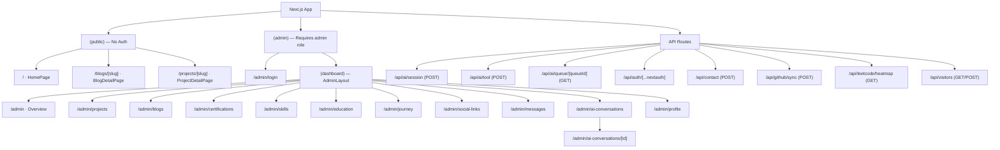

---

## 6. Page → Component Mapping

### HomePage (`/`)

```text
app/(public)/page.tsx  [Server Component, ISR 1h, revalidate=3600]
│
│  Parallel fetch (Promise.all): SiteConfig · Skill[] · Project[] · Certification[]
│                                BlogPost[] · Education[] · SocialLink[] · GitHub heatmap
│
├── components/public/Navbar.tsx
│
├── <main>
│   ├── Hero          ← config, socialLinks
│   ├── About         ← config (bio, aboutText), educationList
│   ├── Skills        ← skills[]
│   ├── Projects      ← projects[]
│   │   └── ProjectModal (client Dialog)
│   ├── Certifications ← certifications[]
│   │   └── CertificateModal (client Dialog)
│   ├── Blogs         ← blogs[], socialLinks
│   │   └── BlogModal (client Dialog)
│   ├── CodingSection ← config (LeetCode stats), githubHeatmap, socialLinks
│   │   └── VisitorCounter → POST /api/visitors (on mount)
│   ├── Journey       ← journeyEntries (from config.journeyEntries JSON array)
│   └── Contact       ← config (email, location)
│       └── react-hook-form + zod → POST /api/contact
│
├── components/public/Footer.tsx  ← socialLinks
│
└── [Root Layout — global]
    ├── VoiceAgent.tsx  (global floating AI launcher, hidden on /admin/*)
    ├── ThemeProvider
    └── Toaster (Sonner)
```

### BlogDetailPage (`/blogs/[slug]`)

```text
app/(public)/blogs/[slug]/page.tsx  [Server Component, ISR 24h]
│  Fetches: blogPost by slug, socialLinks
│
├── Navbar
├── <main>
│   ├── Back button → /#blogs
│   ├── Header: title, tags, LinkedIn badge, publish date, read time
│   ├── Cover image (optional)
│   └── Card
│       └── MarkdownView (components/ui/markdown-view.tsx)
│           OR External article redirect button (canonicalUrl)
└── Footer ← socialLinks
```

### ProjectDetailPage (`/projects/[slug]`)

```text
app/(public)/projects/[slug]/page.tsx  [Server Component, ISR 24h]
│  Fetches: project by slug, socialLinks
│
├── Navbar
├── <main>
│   ├── Back button → /#projects
│   ├── Header: title, tech badges, GitHub stars, GitHub/demo buttons
│   ├── Card: Full Description
│   ├── Grid: Problem Statement | Technical Solution
│   └── Card: Architecture & Data Flow (monospace)
└── Footer ← socialLinks
```

### AdminDashboardPage (`/admin`)

```text
app/(admin)/admin/(dashboard)/page.tsx  [Server Component, force-dynamic]
│  Fetches: counts for projects/certs/blogs/skills/messages, recentMessages, visitorCounter
│
└── AdminLayout (layout.tsx)
    ├── AdminSidebar ← unreadCount, userEmail, signOutAction
    └── <main>
        ├── Stats Cards Grid (7 cards: Visits · Projects · Certs · Blogs · Skills · Journey · Messages)
        └── Card: Recent Contact Form Submissions (last 5)
```

---

## 7. Component Architecture

### Global Components

| Component | Location | Purpose |
|---|---|---|
| `VoiceAgent` | `components/ai/VoiceAgent.tsx` | Global floating AI launcher (hidden on `/admin/*`) |
| `ThemeProvider` | `components/theme-provider.tsx` | Dark/light/system theme (next-themes) |
| `Toaster` | `components/ui/sonner.tsx` | Global toast notifications |

### Layout Components

| Component | Location | Purpose |
|---|---|---|
| `Navbar` | `components/public/Navbar.tsx` | Public portfolio top navigation |
| `Footer` | `components/public/Footer.tsx` | Public portfolio footer with social links |
| `AdminSidebar` | `components/admin/AdminSidebar.tsx` | Admin CMS fixed-width left sidebar with unread badge |

### Public Section Components

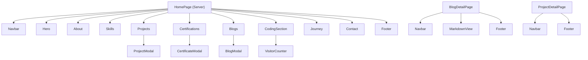

### AI Assistant Components

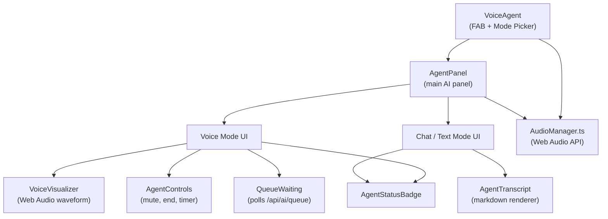

### Admin CMS Components

| Component | Used By | Purpose |
|---|---|---|
| `AdminSidebar` | `(dashboard)/layout.tsx` | Navigation + sign-out |
| `ProfileForm` | `/admin/profile` | Edit all `SiteConfig` fields |
| `ProjectDialog` | `/admin/projects` | Create/edit project |
| `ProjectRowActions` | `/admin/projects` | Edit / delete / sync to GitHub |
| `BlogDialog` | `/admin/blogs` | Create/edit blog post |
| `BlogRowActions` | `/admin/blogs` | Edit / delete |
| `CertificationDialog` | `/admin/certifications` | Create/edit certification |
| `SkillDialog` | `/admin/skills` | Create/edit skill badge |
| `EducationDialog` | `/admin/education` | Create/edit education entry |
| `JourneyDialog` | `/admin/journey` | Create/edit journey milestone |
| `SocialLinkDialog` | `/admin/social-links` | Create/edit social link |
| `MessageRowActions` | `/admin/messages` | Mark read/replied, soft-delete |
| `SuggestReplyDialog` | `/admin/messages` | AI-drafted email reply via Gemini |
| `RevokeSessionButton` | `/admin/ai-conversations` | Terminate live AI sessions |
| `DeleteAiConversationButton` | `/admin/ai-conversations` | Delete conversation record |
| `CloudinaryUpload` | `ProfileForm`, `ProjectDialog`, `BlogDialog` | Image upload widget |

---

## 8. Component Dependency Map

| Component | Used By | Depends On | Type |
|---|---|---|---|
| `Navbar` | All public pages | `usePathname` | Shared/Layout |
| `Footer` | All public pages | `SocialLink[]` prop | Shared/Layout |
| `Hero` | `HomePage` | `SiteConfig`, `SocialLink[]`, `motion` | Section |
| `About` | `HomePage` | `SiteConfig`, `Education[]`, `motion` | Section |
| `Skills` | `HomePage` | `Skill[]`, `Badge` | Section |
| `Projects` | `HomePage` | `Project[]`, `ProjectModal` | Section |
| `ProjectModal` | `Projects` | `Project`, `Dialog`, `Badge` | Feature |
| `Certifications` | `HomePage` | `Certification[]`, `CertificateModal` | Section |
| `Blogs` | `HomePage` | `BlogPost[]`, `SocialLink[]`, `BlogModal` | Section |
| `CodingSection` | `HomePage` | `SiteConfig`, `ContributionCalendar`, `SocialLink[]`, `/api/leetcode/heatmap` | Section |
| `Journey` | `HomePage` | `JourneyEntry[]` (JSON from config), `motion` | Section |
| `Contact` | `HomePage` | `SiteConfig`, `react-hook-form`, `zod`, `POST /api/contact` | Section |
| `VisitorCounter` | `CodingSection` | `GET/POST /api/visitors` | Feature |
| `VoiceAgent` | `app/layout.tsx` (global) | `AgentPanel`, `AudioManager`, `AgentMode` | Global AI |
| `AgentPanel` | `VoiceAgent` | `POST /api/ai/session`, Gemini Live WebSocket, `POST /api/ai/tool` | AI |
| `QueueWaiting` | `AgentPanel` | `GET /api/ai/queue/[queueId]` | AI |
| `AdminSidebar` | `(dashboard)/layout.tsx` | `usePathname`, `Badge`, `Button` | Admin Layout |
| `SuggestReplyDialog` | `/admin/messages` | `SiteConfig.geminiApiKey`, `Dialog` | Admin Feature |
| `CloudinaryUpload` | `ProfileForm`, `ProjectDialog`, `BlogDialog` | `NEXT_PUBLIC_CLOUDINARY_*` env vars | Admin Utility |

---

## 9. Page-to-Component Matrix

| Component | `/` | `/blogs/[slug]` | `/projects/[slug]` | `/admin` | `/admin/*` |
|---|:---:|:---:|:---:|:---:|:---:|
| `Navbar` | ✓ | ✓ | ✓ | | |
| `Footer` | ✓ | ✓ | ✓ | | |
| `Hero` | ✓ | | | | |
| `About` | ✓ | | | | |
| `Skills` | ✓ | | | | |
| `Projects` + `ProjectModal` | ✓ | | | | |
| `Certifications` + `CertificateModal` | ✓ | | | | |
| `Blogs` + `BlogModal` | ✓ | | | | |
| `CodingSection` | ✓ | | | | |
| `Journey` | ✓ | | | | |
| `Contact` | ✓ | | | | |
| `MarkdownView` | | ✓ | | | |
| `VoiceAgent` (global) | ✓ | ✓ | ✓ | | |
| `AdminSidebar` | | | | ✓ | ✓ |
| `ProfileForm` | | | | | ✓ (profile) |
| `*Dialog` components | | | | | ✓ (respective page) |
| `SuggestReplyDialog` | | | | | ✓ (messages) |

---

## 10. Data Flow Architecture

### Public Portfolio Data Flow

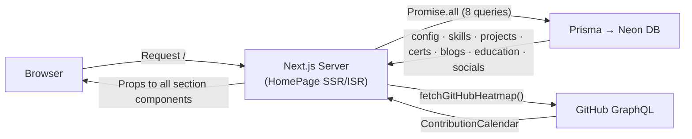

### Contact Form Data Flow

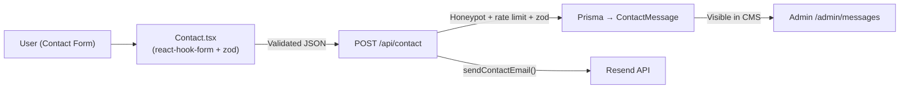

### Admin CRUD Data Flow

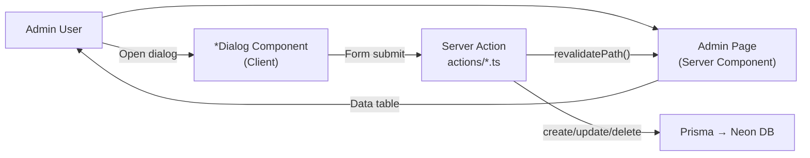

---

## 11. API Architecture

| Method | Endpoint | Called By | Auth | Purpose |
|---|---|---|---|---|
| `POST` | `/api/ai/session` | `AgentPanel.tsx` | Origin allowlist | Create AI session, return ephemeral Gemini token |
| `GET` | `/api/ai/session/status` | `AgentPanel.tsx` | Session token | Check session health |
| `POST` | `/api/ai/session/terminate` | `AgentPanel.tsx` | Session token | Gracefully end session, release voice slot |
| `POST` | `/api/ai/conversation/message` | `AgentPanel.tsx` | Session ID | Persist AI transcript message to DB |
| `GET` | `/api/ai/queue/[queueId]` | `QueueWaiting.tsx` | Queue ID + IP | Poll voice queue position |
| `POST` | `/api/ai/tool` | Gemini server-side executor | Session ID | Execute AI tool call (portfolio/github/search) |
| `GET/POST` | `/api/auth/[...nextauth]` | Auth.js | — | GitHub OAuth callback handlers |
| `POST` | `/api/contact` | `Contact.tsx` | None (rate limited) | Submit contact form |
| `POST` | `/api/github/sync` | `ProjectRowActions.tsx` | Admin session | Sync GitHub stars/forks/language to project |
| `GET` | `/api/leetcode/heatmap` | `CodingSection.tsx` | None | Fetch LeetCode submission heatmap |
| `GET` | `/api/visitors` | `VisitorCounter.tsx` | None | Read current visitor count |
| `POST` | `/api/visitors` | `VisitorCounter.tsx` | None (bot filtered) | Increment visitor count |

### AI Session Sequence

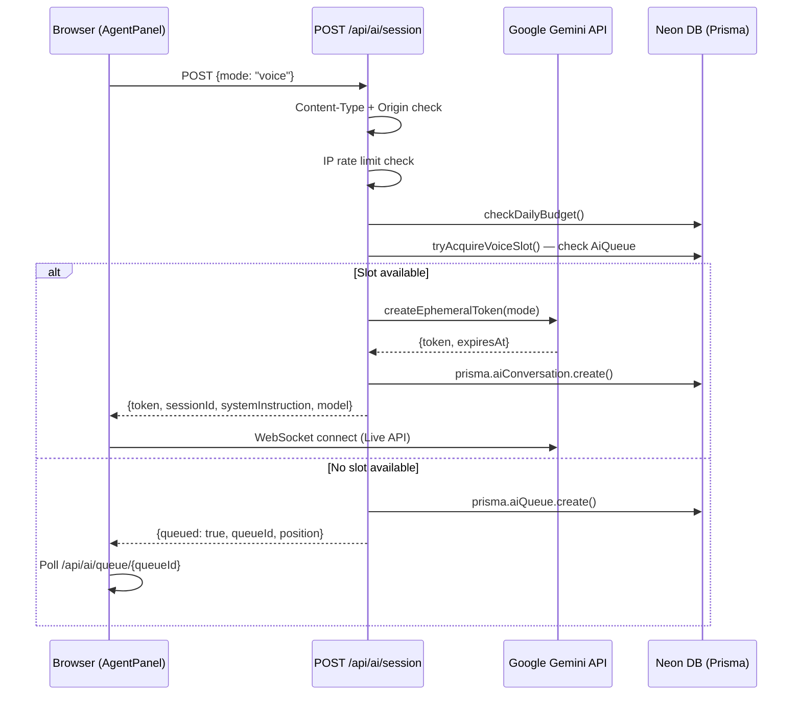

### Contact Form Sequence

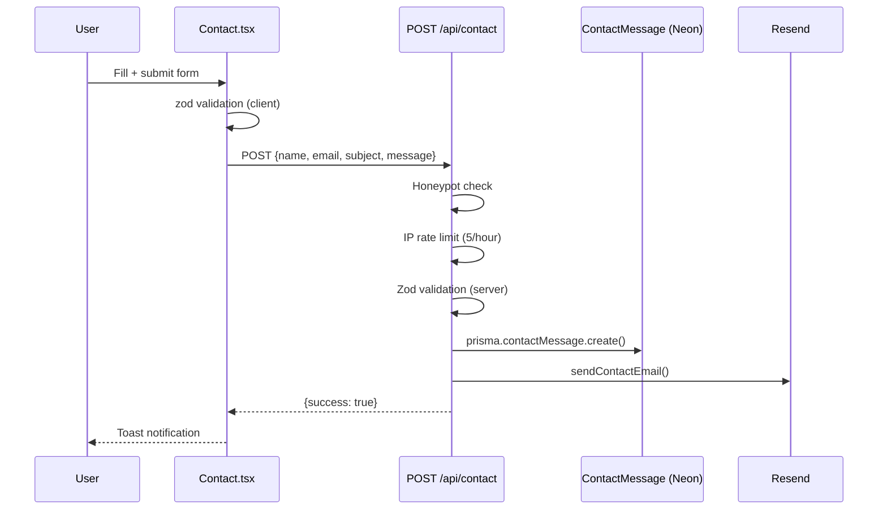

---

## 12. State Management Architecture

This application uses **no global state library** (no Redux, Zustand, or Context for data). State is managed at four levels:

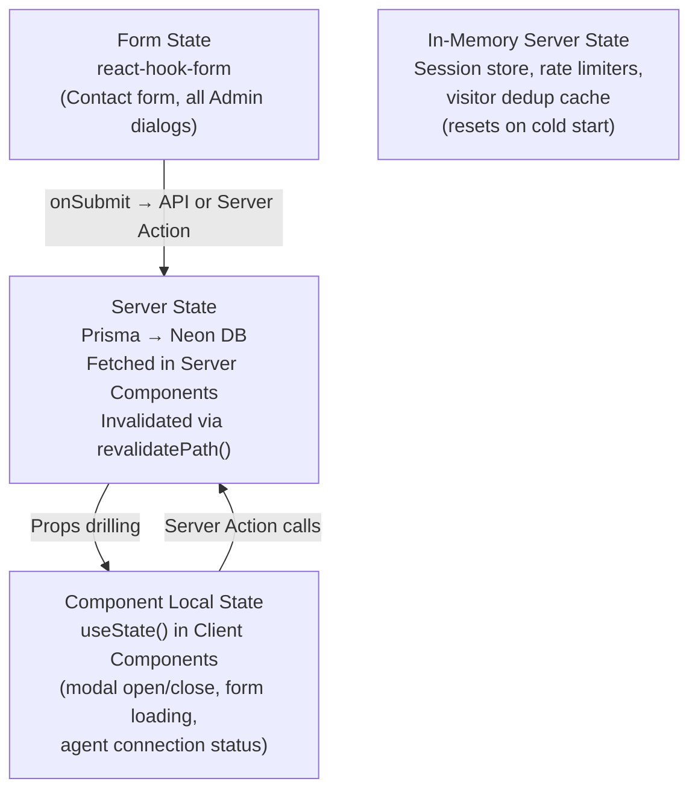

| State Type | Where | What |
|---|---|---|
| **Server / DB state** | Prisma + Neon | All content, AI conversations, usage counters |
| **Local React state** | `useState` in Client Components | Modal open/close, form loading, AI session state, audio state |
| **Form state** | `react-hook-form` | Contact form, all admin CRUD dialogs |
| **Theme** | `next-themes` | `dark` / `light` / `system` (stored in `localStorage`) |
| **In-memory server** | Module-level Maps | Rate limit buckets, voice session registry, visitor dedup |

> **No React Context** is used for data — data flows top-down via props from Server Components, or is fetched client-side via `fetch()`.

---

## 13. Authentication & Authorization Flow

**Strategy:** GitHub OAuth only. Single admin account identified by `ADMIN_EMAIL`. No user registration. JWT sessions.

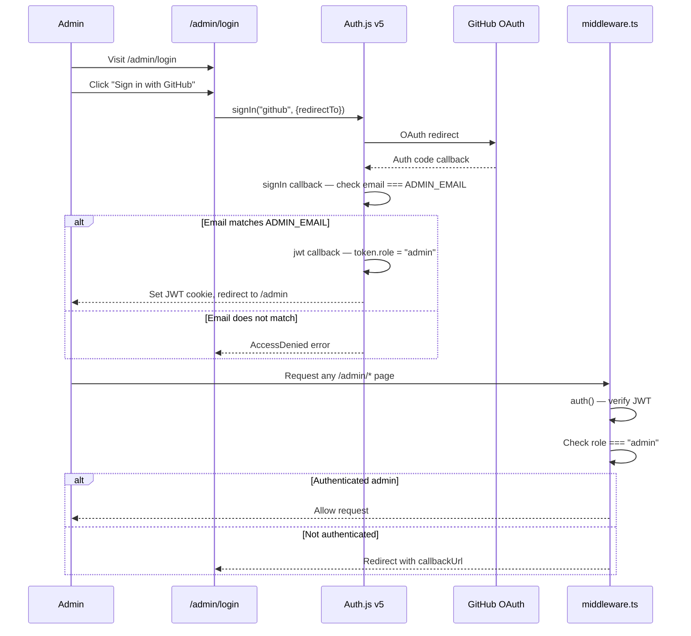

**Key files:**
- [`lib/auth.ts`](lib/auth.ts) — Auth.js config, callbacks, JWT role embedding
- [`middleware.ts`](middleware.ts) — Protects `/admin/*` (except `/admin/login` and `/api/auth/*`)
- [`app/(admin)/admin/(dashboard)/layout.tsx`](app/(admin)/admin/(dashboard)/layout.tsx) — Server-side double-check via `auth()`

---

## 14. AI Agent Architecture

The AI assistant is the most technically complex part of the application. It uses the **Gemini Live API** (WebSocket-based bidirectional streaming) for voice, and a stateful session pattern for text chat.

### AI Security Layers (session creation)

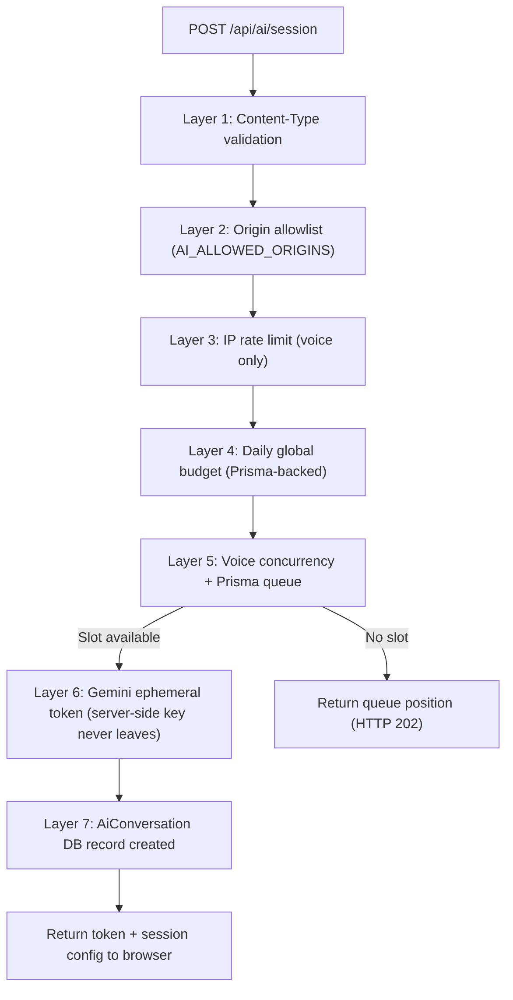

### AI Tools (13 total)

| Tool Name | Category | Data Source |
|---|---|---|
| `get_my_profile` | Portfolio | `SiteConfig` (Prisma) |
| `get_my_projects` | Portfolio | `Project` table (optional keyword filter) |
| `get_my_skills` | Portfolio | `Skill` table (Prisma) |
| `get_my_education` | Portfolio | `Education` table (Prisma) |
| `get_my_certifications` | Portfolio | `Certification` table (Prisma) |
| `get_my_social_links` | Portfolio | `SocialLink` table (Prisma) |
| `get_my_resume` | Portfolio | `SiteConfig.resumeUrl` or env `RESUME_URL` |
| `get_my_blog_posts` | Portfolio | `BlogPost` table (optional keyword filter) |
| `get_my_github` | GitHub | GitHub REST API (cached) |
| `get_my_github_repositories` | GitHub | GitHub REST API (cached repo list) |
| `get_github_repository` | GitHub | GitHub GraphQL (single repo details) |
| `get_github_repository_readme` | GitHub | GitHub REST API (raw README) |
| `get_github_activity` | GitHub | GitHub REST API (recent events) |
| `search_my_public_web_presence` | Search | Tavily API + Google Search Grounding |

### Voice Concurrency Queue

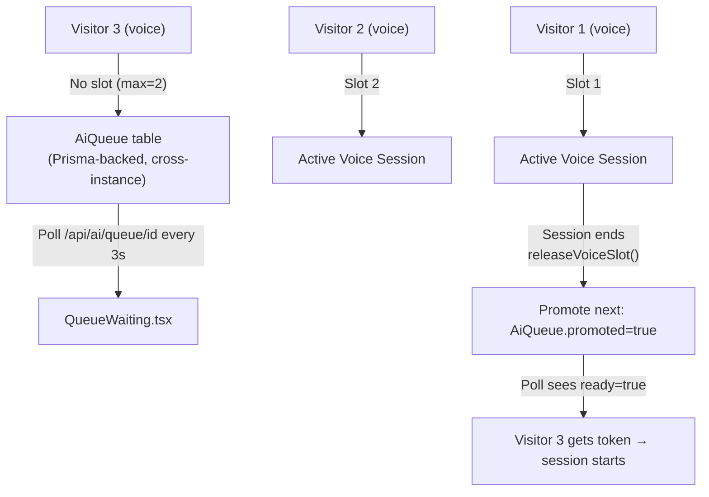

---

## 15. User Journey / Main Flows

### Visitor Views Portfolio

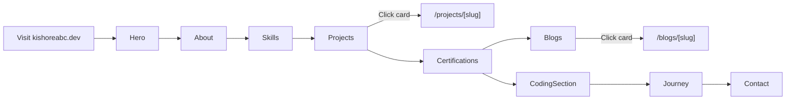

### Visitor Uses AI Assistant

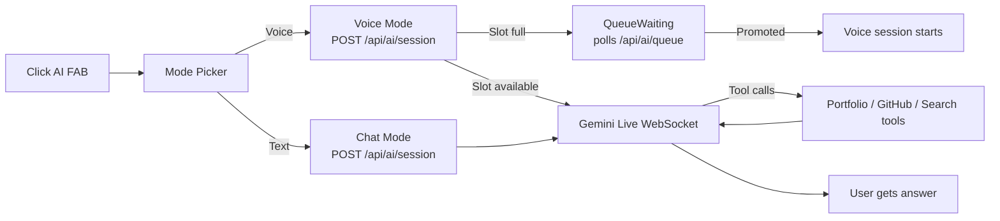

### Admin Manages Content

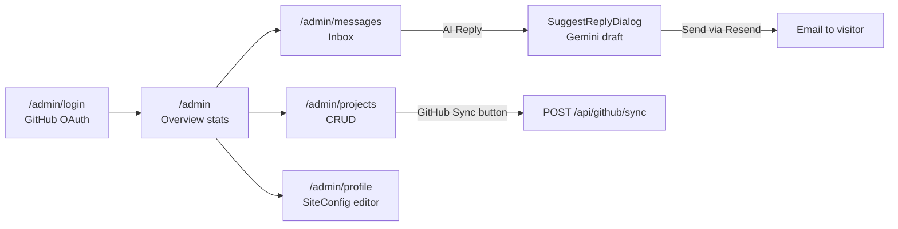

---

## 16. Detailed Page Architecture

### Page: HomePage

**Route:** `/`  
**File:** `app/(public)/page.tsx`  
**ISR Revalidation:** 3600 seconds (1 hour)

**Responsibilities:** Renders the complete single-page portfolio. Fetches all content in a single `Promise.all()` (8 parallel queries) and passes typed props to every section component. SEO metadata is dynamically generated from `SiteConfig`.

**Data Flow:**
```text
Prisma (parallel): SiteConfig · Skill[] · Project[] · Certification[]
                   BlogPost[] · Education[] · SocialLink[]
GitHub GraphQL:    ContributionCalendar (12h Next.js fetch cache)
     ↓
Props to: Hero · About · Skills · Projects · Certifications
          Blogs · CodingSection · Journey · Contact · Footer
```

### Page: BlogDetailPage

**Route:** `/blogs/[slug]`  
**File:** `app/(public)/blogs/[slug]/page.tsx`  
**ISR Revalidation:** 86400 seconds (24 hours)

**Responsibilities:** Renders a single blog post. If `content` field is populated, renders it via `MarkdownView`. Otherwise shows a CTA redirect button to `canonicalUrl` (typically LinkedIn). Generates per-post SEO metadata including Open Graph image.

### Page: ProjectDetailPage

**Route:** `/projects/[slug]`  
**File:** `app/(public)/projects/[slug]/page.tsx`  
**ISR Revalidation:** 86400 seconds (24 hours)

**Responsibilities:** Renders project detail with technology badges, GitHub stats (stars/forks synced via admin), problem/solution cards, architecture notes, and links to GitHub + live demo.

### Page: AdminDashboardPage

**Route:** `/admin`  
**File:** `app/(admin)/admin/(dashboard)/page.tsx`  
**Rendering:** `force-dynamic` (never cached)

**Responsibilities:** Aggregated overview — 7 stat cards (visits, projects, certs, blogs, skills, journey, messages) + 5 most recent contact submissions. Links each stat to its management page.

---

## 17. Cross-Page Navigation

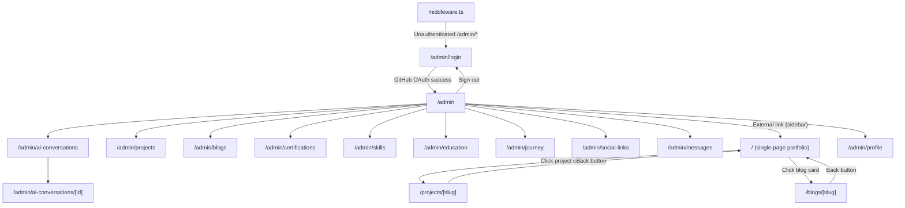

---

## 18. External Integrations

| Integration | Used By | Purpose | Direction | Key File |
|---|---|---|---|---|
| **GitHub GraphQL API** | `lib/github.ts`, `lib/ai/tools/github.ts` | Contribution heatmap, repo data, AI tools | Outbound | `lib/github.ts` |
| **Google Gemini Live API** | `lib/ai/ephemeral-token.ts`, `components/ai/AgentPanel.tsx` | AI voice + text assistant (WebSocket) | Bidirectional | `lib/ai/ephemeral-token.ts` |
| **Resend** | `lib/email.ts`, `actions/message.ts` | Contact email delivery, admin reply | Outbound | `lib/email.ts` |
| **Cloudinary** | `components/admin/CloudinaryUpload.tsx` | Image upload & CDN hosting | Outbound upload | `CloudinaryUpload.tsx` |
| **Tavily Search** | `lib/ai/tools/search.ts` | AI agent web search | Outbound | `lib/ai/tools/search.ts` |
| **Google Search Grounding** | `lib/ai/tools/search.ts` | AI agent Google grounding | Outbound | `lib/ai/tools/search.ts` |
| **Neon PostgreSQL** | `lib/db.ts`, all Prisma calls | Serverless-compatible persistent DB | Bidirectional | `lib/db.ts`, `prisma/schema.prisma` |
| **Auth.js / GitHub OAuth** | `lib/auth.ts` | Admin authentication | Outbound OAuth | `lib/auth.ts` |
| **LeetCode** (unofficial) | `lib/leetcode.ts`, `/api/leetcode/heatmap` | Submission heatmap + stats cache | Outbound scrape | `lib/leetcode.ts` |

---

## 19. Configuration & Environment

All configuration via environment variables. See `.env.example` for the full reference.

| Variable | Purpose | Required |
|---|---|---|
| `DATABASE_URL` | Neon PostgreSQL pooled connection | ✅ |
| `DATABASE_URL_UNPOOLED` | Neon direct connection (migrations) | ✅ |
| `AUTH_SECRET` | Auth.js JWT signing secret | ✅ |
| `GITHUB_CLIENT_ID` | GitHub OAuth app client ID | ✅ |
| `GITHUB_CLIENT_SECRET` | GitHub OAuth app client secret | ✅ |
| `ADMIN_EMAIL` | The only email allowed admin access | ✅ |
| `GITHUB_TOKEN` | GitHub PAT for heatmap + repo API | ✅ |
| `GITHUB_USERNAME` | GitHub username for heatmap query | ✅ |
| `RESEND_API_KEY` | Resend email delivery | ✅ |
| `CONTACT_FROM_EMAIL` | From address for contact emails | ✅ |
| `CONTACT_TO_EMAIL` | Destination for contact emails | ✅ |
| `GEMINI_API_KEY` | Google AI Studio API key | ✅ (for AI) |
| `GEMINI_LIVE_MODEL` | Gemini model for Live sessions | Optional (default: `gemini-3.1-flash-live-preview`) |
| `TAVILY_API_KEY` | Tavily search API | Optional |
| `NEXT_PUBLIC_CLOUDINARY_CLOUD_NAME` | Cloudinary cloud name | Optional |
| `NEXT_PUBLIC_CLOUDINARY_UPLOAD_PRESET` | Cloudinary upload preset | Optional |
| `NEXT_PUBLIC_SITE_URL` | Canonical site URL | ✅ |
| `NEXT_PUBLIC_LEETCODE_USERNAME` | LeetCode username for heatmap | ✅ |
| `AI_ALLOWED_ORIGINS` | Comma-separated allowlist for `/api/ai/*` | Optional (allow-all in dev) |
| `AI_MAX_CONCURRENT_VOICE` | Max simultaneous voice sessions | Optional (default: 2) |
| `AI_DAILY_SESSION_LIMIT` | Max AI sessions per day (global) | Optional (default: 100) |
| `PORTFOLIO_URL` | Portfolio URL for AI system prompt | Optional |
| `RESUME_URL` | Resume PDF URL for AI agent | Optional |

**Runtime configuration** (stored in DB, editable via `/admin/profile`):
- `SiteConfig.geminiApiKey` — overrides `GEMINI_API_KEY` at runtime
- `SiteConfig.geminiModel` — overrides model at runtime without redeployment
- All portfolio content (hero text, bio, achievements JSON, journey entries JSON, LeetCode stats)

---

## 20. Build & Deployment Architecture

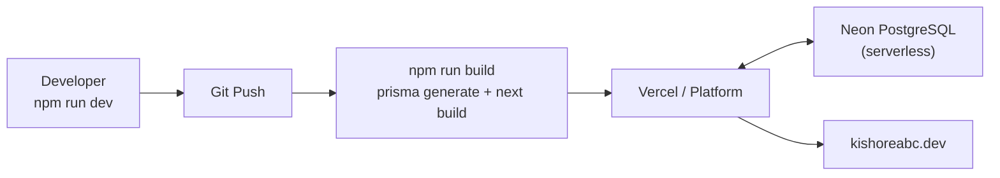

**Build process:**
1. `prisma generate` — generates Prisma Client from `schema.prisma`
2. `next build` — TypeScript compile, ISR page pre-generation, bundle optimization

**Database management scripts:**

| Script | Purpose |
|---|---|
| `npm run db:push` | Push schema changes without migration history |
| `npm run db:migrate` | Create and apply new migration |
| `npm run db:migrate:deploy` | Deploy migrations in production |
| `npm run db:seed` | Seed initial data from `prisma/seed.ts` |
| `npm run db:studio` | Open Prisma Studio GUI |

**Caching strategy:**
- Homepage: ISR revalidation every **1 hour**
- Blog/Project detail pages: ISR every **24 hours**
- Admin pages: `force-dynamic` (always fresh)
- GitHub heatmap: Next.js `fetch` cache with **12-hour** TTL (`revalidate: 43200`)
- AI GitHub tools: In-memory LRU cache with per-tool TTLs (15 min – 2 hours)

---

## 21. Important Architectural Decisions

| Pattern | Where Used | Why It Matters |
|---|---|---|
| **Route Groups** `(public)` / `(admin)` | `app/` | Clean URL separation without route segment in URL |
| **Server Components by default** | All page/layout files | Zero client JS for static sections; data fetched at render |
| **`Promise.all()` parallel fetching** | `app/(public)/page.tsx`, admin pages | Single round-trip for all data; minimises TTFB |
| **ISR (Incremental Static Regeneration)** | Public pages | Static-like performance with automatic content freshness |
| **Prisma singleton pattern** | `lib/db.ts` | Prevents connection pool exhaustion in dev hot-reload and serverless |
| **Ephemeral Token Pattern** | `lib/ai/ephemeral-token.ts` | Gemini API key never leaves server; client gets short-lived token |
| **Prisma-backed AI queue** | `lib/ai/concurrency.ts` | Queue state survives serverless cold starts and multiple instances |
| **Server Actions for CRUD** | `actions/*.ts` | Type-safe, co-located mutations with automatic `revalidatePath()` |
| **Dynamic system prompt** | `lib/ai/system-prompt.ts` | AI agent reflects current `SiteConfig` without redeployment |
| **Pure tool-based AI design** | `lib/ai/tools/` | No hardcoded portfolio data in prompt — agent fetches live data |
| **Soft-delete for messages** | `ContactMessage.deletedAt` | Messages never hard-deleted; recoverable by admin |
| **SHA-256 IP hashing** | AI concurrency, queue | IP addresses never stored raw — privacy-preserving |
| **Dual Zod validation** | `Contact.tsx` + `/api/contact` | Server validation cannot be bypassed by skipping the frontend |
| **`force-dynamic` on admin** | Admin pages | Admin always sees live data; never shows stale cached content |
| **JSON columns for flexible arrays** | `SiteConfig.achievements`, `.journeyEntries` | Owner can add/remove milestones without DB schema migrations |
| **shadcn/ui source-in-repo** | `components/ui/` | Full component source owned by project — no black-box dependency |
| **Origin allowlist for AI routes** | `lib/ai/security.ts` | Prevents API abuse from external domains in production |

---

## 22. Architecture Summary

```text
                        ┌───────────────┐
                        │   VISITOR /   │
                        │   RECRUITER   │
                        └───────┬───────┘
                                │  https://kishoreabc.dev
                                ▼
               ┌────────────────────────────────────┐
               │           NEXT.JS 16               │
               │         APP ROUTER                 │
               ├─────────────┬──────────────────────┤
               │  (public)   │       (admin)         │
               │  ISR Pages  │  Auth-gated CMS       │
               └──────┬──────┴──────────┬────────────┘
                      │                 │
          ┌───────────┼─────────────────┤
          ▼           ▼                 ▼
   ┌────────────┐ ┌────────┐  ┌────────────────────┐
   │   PUBLIC   │ │  API   │  │   SERVER ACTIONS    │
   │ COMPONENTS │ │ ROUTES │  │   (admin CRUD)      │
   │ Hero·About │ │ /ai/*  │  │   actions/*.ts      │
   │ Skills·etc │ │/contact│  └──────────┬──────────┘
   └─────┬──────┘ │/visitor│             │
         │        └────┬───┘             │
         │             │                 │
         │    ┌─────────▼────────────────▼──────┐
         │    │           PRISMA ORM             │
         │    │       Neon PostgreSQL            │
         │    │   13 models (SiteConfig,         │
         │    │   Project, Blog, Skill, etc.)    │
         │    └────────────────────────────────┘
         │
         ▼
   ┌─────────────────────┐
   │   AI SUBSYSTEM      │
   │  7-Layer Security   │
   │  Ephemeral Tokens   │
   │  Concurrency Queue  │
   │  In-memory Sessions │
   │  13 Tool Functions  │
   │  Daily Budget       │
   └──────────┬──────────┘
              │
     ┌────────▼────────────────────────┐
     │  Google Gemini Live API         │  ← Voice (WebSocket) + Text (Chat)
     │  GitHub GraphQL / REST API      │  ← Heatmap, repo stats, AI tools
     │  Resend                         │  ← Contact email, admin reply
     │  Cloudinary                     │  ← Image hosting
     │  Tavily + Google Grounding      │  ← AI web search
     └─────────────────────────────────┘
```
